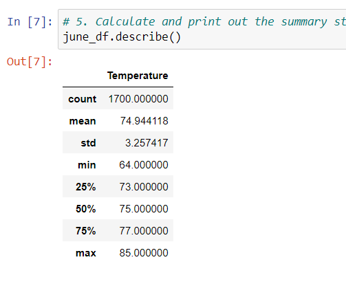
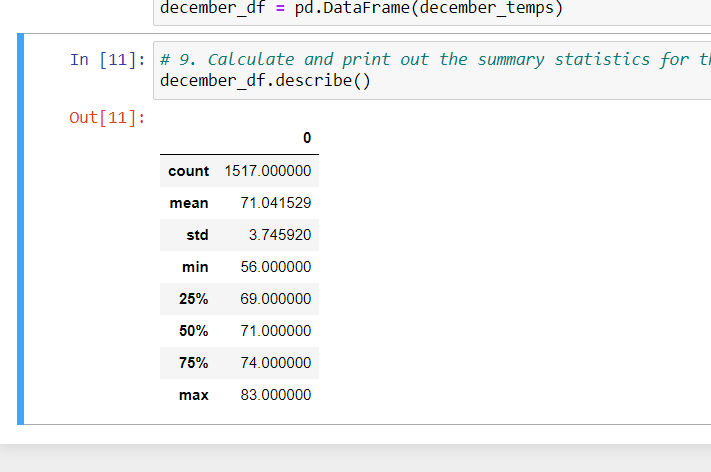

# Surf's Up
Local Hawaii weather data using SQLite, Jupyter Notebook, and SQLalchemy

## Overview of the analysis
### Purpose of the analysis
The overall objective of this analysis was to help determine the viability of a business that sells surfing equipment and ice cream in Hawaii. In this example, and investor was concerned about the length of the season such a business could remain open each year. To aid in decision-making, a sqlite database containing temperature observations was queried, in order to generate summary data regarding the temperatures in June and December. If the temperatures in the winter are similar to those in the summer, that would generally be a good sign that such a business could operate year-round.

## Results
### June temperature summary
The findings from the June temperature query can be seen here: 

The database included 1700 temperature observations from June over the course of the years in the dataset. The mean June temperature was 74.9 degrees, the highest observation was 85 degrees, and the lowest was 64. Importantly, the lower quartile was a reasonable 73 degrees, indicating that at least three fourths of the June observations were above 70.

### December temperature summary
The findings from the December temperature query can be seen here: 

The 1517 December temperature observations had a mean of about 71 degrees. The lowest observation was 56 degrees, the lower quartile was 69 degrees, and the highest observation was 83 degrees. Both months featured a standard deviation between three and four degrees, and a minimal difference between the mean and median temperatures, indicating that the weather is not especially prone to outliers in either direction.

### Comparison between seasons
- The difference in the average temperatures between June and December was only about four degrees. Both months had a mean and median in the 70s.
- The coldest observed temperature in December was substantially different, with December's low being eight degrees below June's low. Importantly, the June low is 64, at which temperature the shop might be able to remain open, while the December low is 56, which would be a significant obstacle to this type of business.
- The warmest December days were very similar to the warmest days in June. December's high was 83 degrees, while June's was 85.

## Summary
### Summary of the results
Overall, the summer and winter temperatures appear to be reasonably similar in Hawaii. While December's coldest days to seem to be difficult for a business that depends on warm weather, the lower quartile is still somewhat reasonable, indicating that most days are not excessively cold even in the winter.

### Recommendations for further analysis
- Before concluding the analysis, it would be worthwhile to verify whether other winter months are similar to December in terms of the overall temperature pattern. Some locations can experience even lower temperatures in January or February, which could be the difference beteween mild days in the low 70s and more uncomfortable average temperatures. 
- Another important element of the weather for this business would be to check the average precipitation. Particularly, queries to determine how many days reported a significant amount of rain, compared to the total number of days in the data set, would be worthy of consideration.